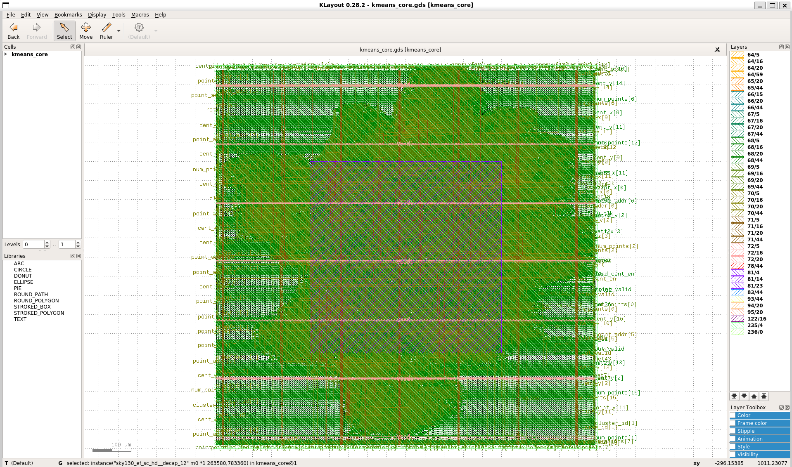
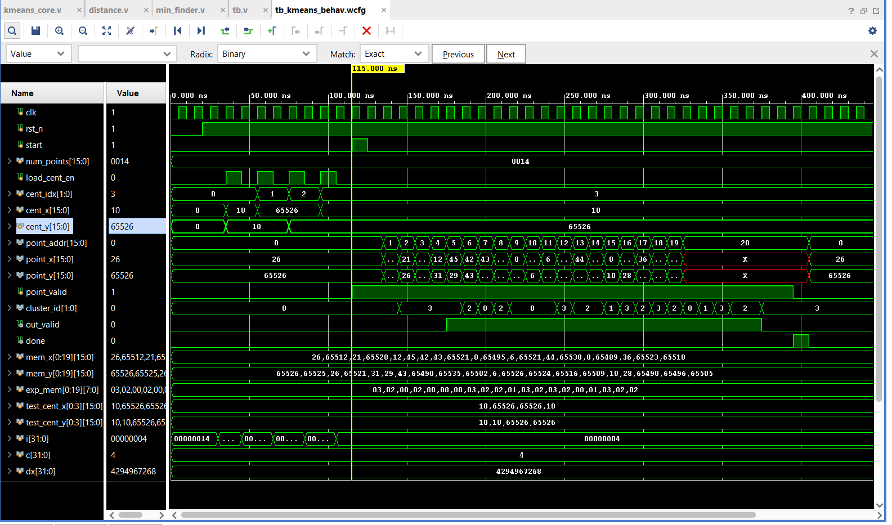

# K-Means Hardware Accelerator

Designed and verified a deeply pipelined K-means clustering accelerator, executing the complete physical design flow from RTL to GDSII using the SkyWater 130nm PDK.

This Domain-Specific Accelerator offloads distance calculation and cluster assignment from a host CPU. It processes 2D coordinate data points against $K=4$ centroids using a fully unrolled parallel architecture.

## Architecture & Pipeline
The core calculates the Squared Euclidean Distance for incoming data streams: 
$d^2 = (x - c_x)^2 + (y - c_y)^2$

* **Data Width:** 16-bit Fixed-Point Arithmetic (Signed 2's Complement).
* **Throughput:** 1 Coordinate Point per clock cycle (Initiation Interval = 1).
* **Pipeline Depth:** 5 Clock Cycles (3 cycles for Processing Elements, 2 cycles for Min-Finder).

The datapath consists of three primary stages:
1. **Processing Elements (PEs):** 4 parallel multiplier-accumulator units that compute the squared distance to all 4 centroids simultaneously. Expanded internal bit-widths prevent overflow during subtraction and squaring.
2. **Comparator Tree:** A 2-stage pipelined tournament tree to find the minimum distance and output the winning `cluster_id`.
3. **FSM Controller:** Manages centroid loading, data valid signaling, memory stream tracking, and pipeline draining.

## ASIC Physical Design: Sky130 
The core was pushed through the OpenROAD/OpenLane RTL-to-GDS implementation flow targeting the open-source SkyWater 130nm node. 

| Metric | Result |
| :--- | :--- |
| **Technology Node** | Sky130 (130nm) |
| **Die Area** | 1000 µm x 1000 µm (Absolute) |
| **Target Clock** | 100 MHz (10.0ns period) |
| **Setup/Hold Violations** | 0 (Timing Clean) |
| **DRC / LVS Violations** | 0 (Sign-off Clean) |

### Final GDSII Silicon Layout

*(Layout view generated via KLayout showing power grid routing and standard cell placement)*

## FPGA Synthesis & PPA 
Initial synthesis and logic validation were performed targeting the Xilinx Artix-7 FPGA (`xc7a35tcpg236-1`) using Vivado.

| Metric | Value |
| :--- | :--- |
| **Max Frequency (Fmax)** | 186.74 MHz |
| **Throughput** | 186.74 Million Points/sec |
| **Slice LUTs** | 379 (1.82%) |
| **Slice Registers** | 489 (1.18%) |
| **Dedicated DSP Slices** | 8 (8.89%) |

## Verification 
The RTL is fully verified using a self-checking behavioral Verilog testbench. The testbench automatically generates randomized 2D coordinate streams, computes a zero-time software golden model, drives the hardware inputs, and asserts the pipeline output against the expected results.


*(Vivado waveform demonstrating centroid loading, continuous streaming, and pipeline latency)*

## 📁 Repository Structure
```text
├── src/                    # Verilog RTL Source Code
│   ├── kmeans_core.v
│   ├── distance_calc_2d.v
│   └── min_finder_4.v
├── sim/                    # Self-checking behavioral testbench
│   └── tb_kmeans.v
├── openlane/               # Physical design constraints and GDSII layout shots
│   └── config.json         
└── images/                 # Simulation waveforms 
