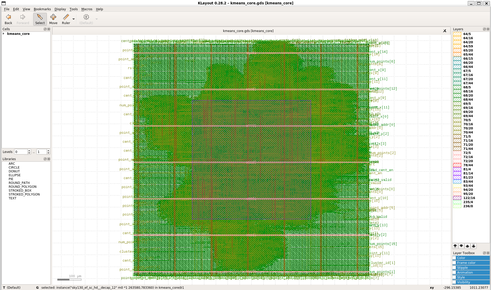

# K-Means Clustering Hardware Accelerator

A pipelined, parameterised K-means accelerator in SystemVerilog. For every 2-D
point it finds the nearest of K centroids **and** accumulates per-cluster sums
and counts, so one pass over the data is a complete Lloyd iteration: the host
only divides `sum / count`.

Verified with a constrained-random cocotb testbench with functional coverage,
an exhaustive datapath test, and SymbiYosys formal proofs; lint-clean under
Verilator -Wall. Design rationale and trade-offs: [docs/DESIGN.md](docs/DESIGN.md).

| | |
|---|---|
| Throughput | 1 point per clock (initiation interval 1) |
| Latency | 3 + log2(K) cycles (5 for K = 4) |
| Clusters | any power of two K >= 2; verified for K = 2, 4, 8, 16 |
| Arithmetic | signed 16-bit coordinates, exact 33-bit squared distances |
| Interfaces | valid/ready streams in and out with full back-pressure, centroid configuration, per-cluster statistics read-back |

## Architecture

```
  s_x, s_y  (valid / ready)
      |
      +-------------+-------------+--- ... ---+
      v             v             v           v
  +--------+    +--------+    +--------+  +--------+    centroid registers
  |  PE 0  |    |  PE 1  |    |  PE 2  |  | PE K-1 |    (written while idle)
  +--------+    +--------+    +--------+  +--------+
   3 stages: subtract -> square (DSP) -> add, 33-bit result
      |             |             |           |
      +------+------+             +-----+-----+
             v                          v
        [ compare ]                [ compare ]        arg-min tree,
             +-------------+------------+             one registered level per stage,
                           v                          ties go to the lower index
                      [ compare ]
                           |
               m_cluster, m_dist (valid / ready)
                           |
                           v
        per-cluster sum_x, sum_y, count  +  total SSE   (update-step statistics)
```

The whole pipeline advances together and stalls when the output is not
accepted. Each stage only loads when it receives a valid point.

## Host flow (one Lloyd iteration)

1. While idle, write the K centroids: `cfg_we`, `cfg_idx`, `cfg_cx`, `cfg_cy`.
2. Pulse `start` with `num_points`.
3. Stream points on `s_valid/s_ready/s_x/s_y`. Accept per-point results on
   `m_valid/m_ready/m_cluster/m_dist` (tie `m_ready` high if only the
   statistics are needed).
4. When `done` pulses, read `acc_sum_x`, `acc_sum_y`, `acc_count` for each
   cluster through `acc_idx`. New centroid = sum / count; `sse` measures
   convergence.
5. Repeat until the centroids stop moving.

`tb/test_kmeans.py::test_lloyd_full_algorithm` runs exactly this loop and
checks every iteration against a pure-software K-means.

## Ports

| Port | Dir | Width | Description |
|---|---|---|---|
| `clk`, `rst_n` | in | 1 | clock, active-low asynchronous reset |
| `cfg_we`, `cfg_idx`, `cfg_cx`, `cfg_cy` | in | 1, log2 K, 16, 16 | centroid write; ignored while busy |
| `start`, `num_points` | in | 1, 16 | start a run of `num_points` points; ignored while busy |
| `busy`, `done` | out | 1 | run in progress; one-cycle pulse when the last result is accepted |
| `s_valid`, `s_ready`, `s_x`, `s_y` | in/out | 1, 1, 16, 16 | point stream |
| `m_valid`, `m_ready`, `m_cluster`, `m_dist` | out/in | 1, 1, log2 K, 33 | result stream |
| `acc_idx` | in | log2 K | selects the cluster for read-back |
| `acc_sum_x`, `acc_sum_y`, `acc_count` | out | 32, 32, 16 | statistics of cluster `acc_idx`, valid from `done` until the next `start` |
| `sse` | out | 49 | sum of squared distances over the run |

## Verification

### Simulation: cocotb + Icarus Verilog (`make sim`)

Every per-point result, every accumulator and the SSE are compared with a
pure-Python model ([tb/model.py](tb/model.py)), with random gaps on the input
stream and random back-pressure on the output.

| Test | Checks |
|---|---|
| `test_overflow_regression` | the exact case the v1 core got wrong |
| `test_extreme_values` | coordinates at -32768 / 32767; all centroids far from all points (distances above 2^32) |
| `test_ties` | duplicate centroids: the lower index must win |
| `test_random_stress` | 4 x 1500 full-range random points, 70 % input valid, 60 % output ready |
| `test_full_rate` | 1000 points with no stalls finish in N + latency cycles (II = 1) |
| `test_zero_points` | `num_points = 0` finishes cleanly |
| `test_back_to_back_runs` | accumulators clear on every start |
| `test_cfg_ignored_while_busy` | centroid writes during a run are ignored |
| `test_lloyd_full_algorithm` | complete K-means converges and matches the software reference iteration by iteration |
| `test_coverage_closure` | fails unless every functional-coverage bin was hit |

The suite runs for K = 2, 4, 8 and 16; all coverage bins close for every K
(18 bins for K = 4, including back-pressure, a completely full pipeline,
ties, empty clusters and distances that overflowed in v1). Re-inserting the
v1 32-bit truncation makes four tests fail immediately.

`make -C tb TEST=pe` drives **all 131,071 possible coordinate differences**
through one distance PE (plus 20,000 random inputs) and checks each result
exactly.

### Formal: SymbiYosys + Yices (`make formal`)

| Check | Kind | Configuration | Result |
|---|---|---|---|
| Arg-min tree returns the minimum and the lowest index holding it | unbounded proof (k-induction) | 33-bit, K = 2, 4, 8, 16 | proven |
| Control and handshake: stalled output holds its value; no `s_ready` or `m_valid` while idle; counters and in-flight valid bits stay consistent | unbounded proof (k-induction) | 16-bit data, 16-bit counts, K = 4 | proven |
| Scoreboard: results never outnumber points, at most `latency` in flight, `done` only after exactly `num_points` results | bounded, 20 cycles | 16-bit data | pass |
| End-to-end data integrity for an arbitrary point (`anyconst` token) | bounded, 16 cycles | 2-bit data, K = 4 and K = 8 | pass |
| Cover: a full run, a stalled full pipeline, a tracked point landing in the last cluster | cover | | reached |

Proving multipliers equivalent is beyond SAT solvers at 16 bits, so the
end-to-end data property runs at a small width and the arithmetic is covered
at full width by the exhaustive PE test. See [docs/DESIGN.md](docs/DESIGN.md).

## Implementation

### Resource estimate: Yosys `synth_xilinx` (Artix-7), `make synth`

| K | LUTs | FFs | DSP48E1 | CARRY4 | Latency (cycles) |
|---|---|---|---|---|---|
| 2 | 391 | 490 | 4 | 68 | 4 |
| 4 | 718 | 817 | 8 | 94 | 5 |
| 8 | 1258 | 1438 | 16 | 146 | 6 |
| 16 | 2371 | 2647 | 32 | 250 | 7 |

The update-step statistics account for about 350 LUTs and 530 FFs at K = 4
(the assignment-only datapath is 371 LUTs / 286 FFs). Vivado usually maps
to fewer LUTs than Yosys.

### Vivado and OpenLane

v1 is the original assignment-only core. v2 was implemented with Vivado
2025.1 out of context (the core alone, no pins) with a 4 ns clock target;
its maximum frequency is estimated as 1 / (period - worst slack). The
OpenLane run has not been repeated for v2 yet.

| Flow | Metric | v1 | v2 (K = 4) |
|---|---|---|---|
| Vivado, xc7a35tcpg236-1 | Fmax | 186.74 MHz | about 209 MHz |
| | LUTs / FFs / DSP48E1 | 379 / 489 / 8 | 747 / 947 / 8 |
| OpenLane, Sky130 | Die area | 1000 x 1000 um | |
| | Clock target | 100 MHz | |
| | Setup / hold, DRC / LVS | 0 / 0, 0 / 0 | |

v2 adds the per-cluster sums, counts and the SSE (the extra LUTs and
flip-flops) and still runs faster than v1.

To run OpenLane, copy `rtl/*.sv` into the design's `src/` folder next to
`openlane/config.json`.



## Running it

```
make lint      # Verilator -Wall for K = 2, 4, 8, 16
make sim       # cocotb regression for every K + exhaustive PE test
make formal    # SymbiYosys proofs and bounded checks
make synth     # Yosys area sweep
make -C tb K=8 SEED=42 WAVES=1   # one configuration, chosen seed, waveforms
```

Requires Icarus Verilog 12, Verilator 5, Yosys, SymbiYosys with Yices, and
Python 3 with `cocotb >= 2.0`. CI runs all of it on every push
([.github/workflows/ci.yml](.github/workflows/ci.yml)).

## Repository layout

```
rtl/
  kmeans_core.sv     top level: control, PEs, accumulators
  distance_calc.sv   3-stage squared-distance PE
  min_tree.sv        pipelined, parameterised arg-min tree
tb/
  test_kmeans.py     cocotb regression (+ model.py, coverage.py)
  test_distance_calc.py   exhaustive PE test
formal/
  kmeans_formal.sv, kmeans.sby       core properties
  min_tree_formal.sv, min_tree.sby   tree proof
synth/sweep.py       Yosys area sweep
openlane/            OpenLane configuration and v1 layout
docs/DESIGN.md       design rationale
```

## Changes from v1

* **Fixed:** squared distance truncated to 32 bits, so far centroids could
  wrap around and win. Distances are now 33 bits and exact.
* **Fixed:** a gap in the input stream skipped points (the address advanced
  without a valid point). Replaced by a valid/ready stream with back-pressure.
* **Fixed:** completion used a fixed drain delay; `done` now follows the last
  accepted result.
* **New:** update-step statistics (sums, counts, SSE), so the core runs whole
  Lloyd iterations.
* **New:** parameterised K, valid-gated stage enables, cocotb + coverage,
  exhaustive PE test, formal proofs, area sweep, CI.
